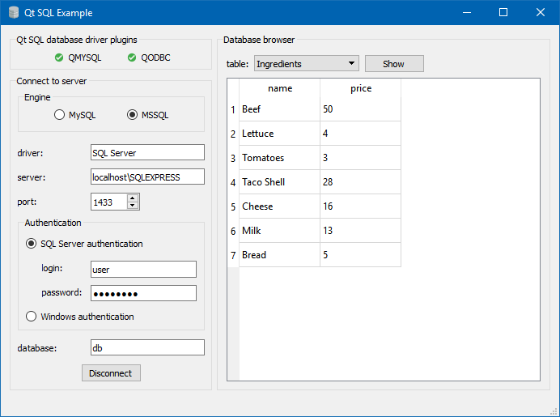

Данный проект является шаблоном для создания СУБД на основе фреймворка QT и SQL для Linux. Также может использоваться на Windows

# Qt SQL Example

An exemplary [Qt](https://www.qt.io/) app that connects to SQL server and displays a table from a database. The program was made for educational purposes.

Compiled Windows and Linux applications with statically-linked libraries can be downloaded from [Releases](https://github.com/andre-wojtowicz/qt-sql-example/releases).

The application is developed with Qt 5.9.1 on Windows 10 and Ubuntu 16.04.
The program was tested on MySQL Server 5.5.57 and Microsoft SQL Server 2008 R2 SP3.

## Client config

The program reads `config.ini` on startup. The file must be in the app working directory.

## SQL database drivers

A comprehensive discussion about SQL database drivers (Qt driver plugins as well as system drivers) can be found in [Qt Documentation](https://doc.qt.io/qt-5/sql-driver.html). MSSQL is handled by the ODBC driver.

Although binaries of the program have statically-linked libraries, in order to connect from Linux to MSSQL server, one should install ODBC SQL Server driver (e.g. `msodbcsql17`__*__).

The following section covers the essential tools to develop app with dynamically-linked SQL libraries.

### Windows 10

Оба драйвера для работы с базами данных в Qt (QMYSQL и QODBC) должны уже поставляться вместе с Qt SDK.

Драйвер для MySQL можно установить, поместив файл libmysql.dll из C API для MySQL (mysqlclient) в рабочий каталог приложения.
Диспетчер драйверов ODBC и драйвер для SQL Server встроены, поэтому дополнительная установка не требуется. В качестве альтернативы драйверу для SQL Server можно использовать Microsoft ODBC Driver; см. документацию Microsoft.

### Ubuntu 16.04

Пакеты с драйверами для Qt и системными SQL-драйверами:

* MySQL - `libqt5sql5-mysql` `libmysqlclient20`,
* ODBC (Диспетчер драйверов unixODBC и Microsoft ODBC Driver) - `libqt5sql5-odbc` `libodbc1` `unixodbc` `odbcinst` `msodbcsql17`__*__.

__*__ Как установить `msodbcsql17` - [Установка Microsoft ODBC Driver для SQL Server на Linux и macOS](https://docs.microsoft.com/en-us/sql/connect/odbc/linux-mac/installing-the-microsoft-odbc-driver-for-sql-server).
